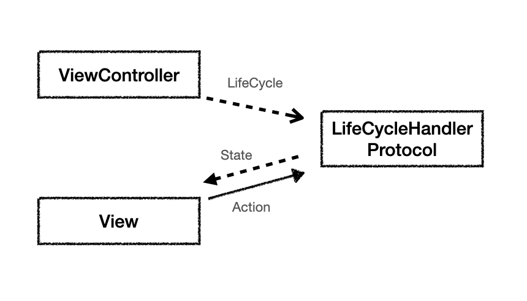

# Description
Blog: [Link](https://doing-programming.tistory.com/entry/SwiftUI-SwiftUI-%ED%99%98%EA%B2%BD%EC%97%90%EC%84%9C-ViewController-Life-Cycle-%EC%82%AC%EC%9A%A9%ED%95%98%EA%B8%B0)

You can use UIViewController Life Cycle in SwiftUI

# Concept

